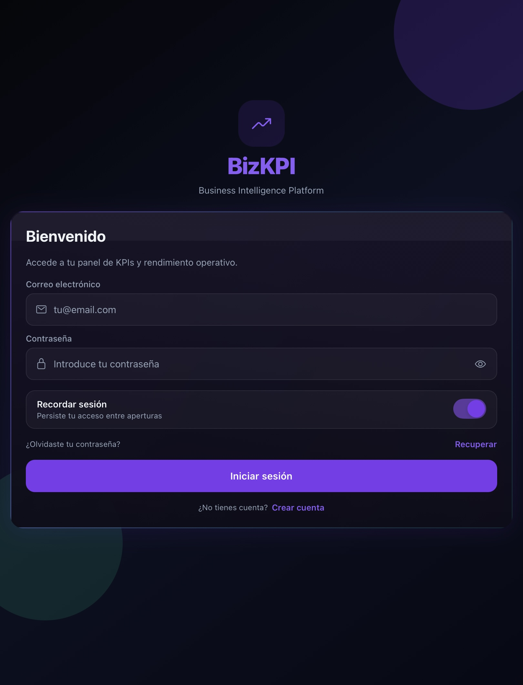
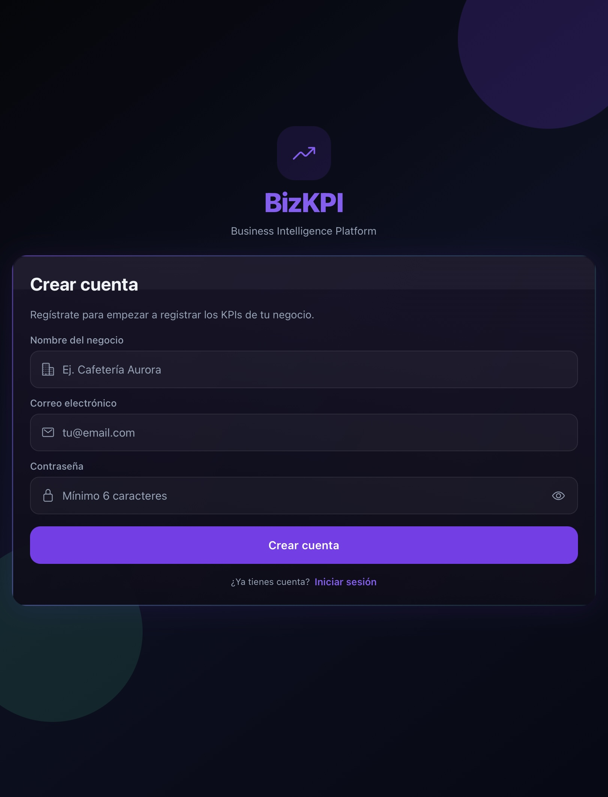
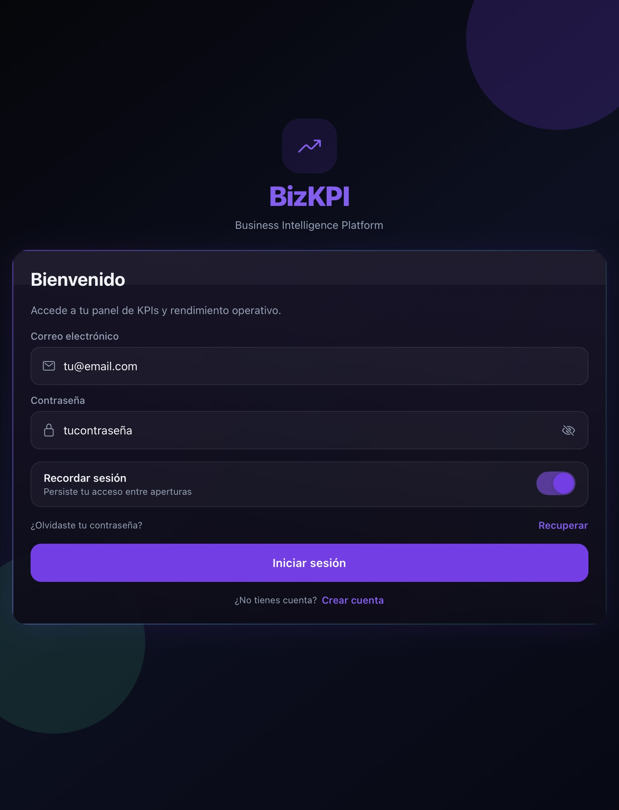
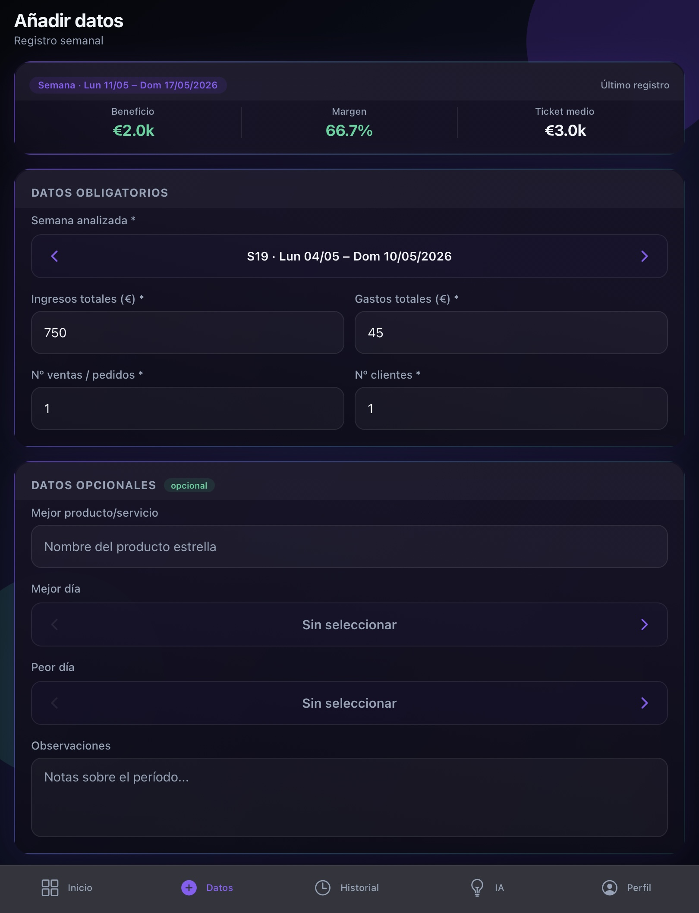
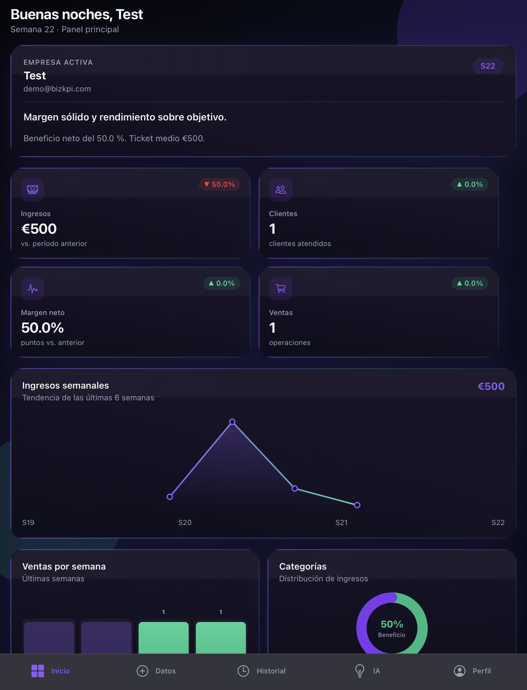
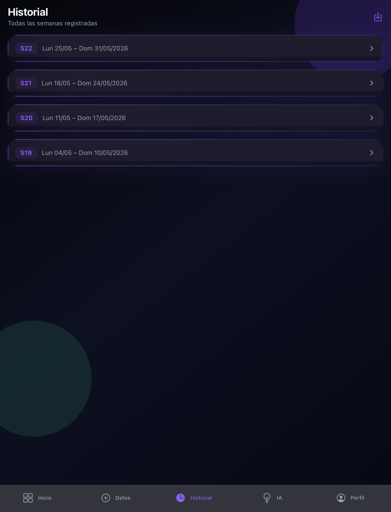
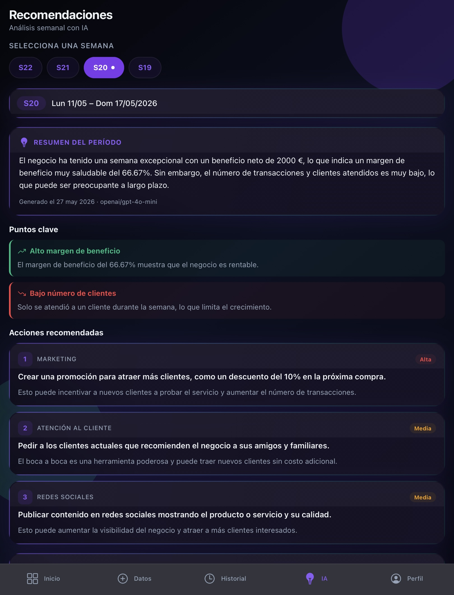
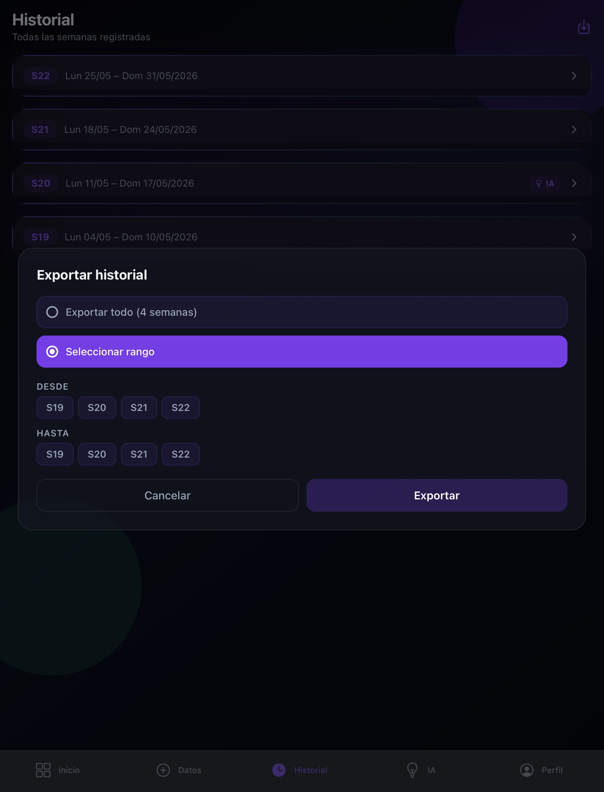
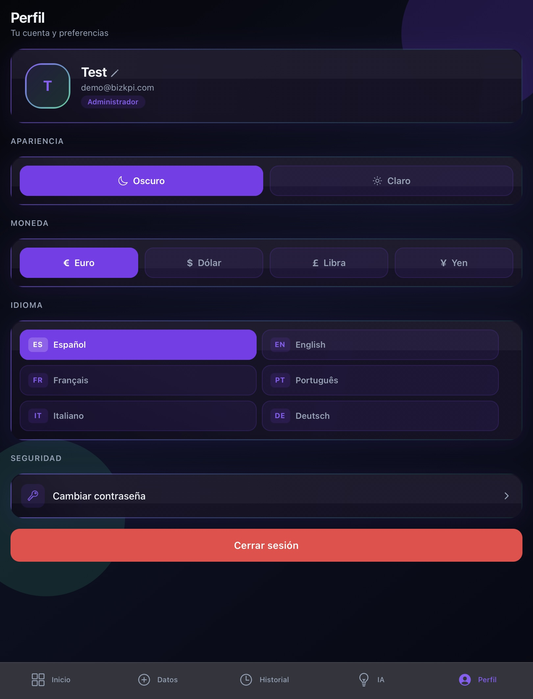

# Manual de usuario — BizKPI

### Guía completa para usar la aplicación

*Versión 1.0 · Última actualización: mayo 2026*

---

## Tabla de contenidos

1. [Bienvenida](#1-bienvenida)
2. [Primeros pasos](#2-primeros-pasos)
3. [Registro de datos semanales](#3-registro-de-datos-semanales)
4. [Dashboard](#4-dashboard)
5. [Historial](#5-historial)
6. [Recomendaciones con IA](#6-recomendaciones-con-ia)
7. [Exportar a CSV](#7-exportar-a-csv)
8. [Perfil y ajustes](#8-perfil-y-ajustes)
9. [Glosario de KPIs](#9-glosario-de-kpis)
10. [Preguntas frecuentes (FAQ)](#10-preguntas-frecuentes-faq)
11. [Solución de problemas](#11-solución-de-problemas)
12. [Contacto y soporte](#12-contacto-y-soporte)

---

## 1. Bienvenida

### ¿Qué es BizKPI?

**BizKPI** es una aplicación móvil pensada para propietarios de pequeños negocios —bares, restaurantes, tiendas locales, talleres, peluquerías, etc.— que quieren entender la salud financiera de su negocio sin complicaciones.

La idea es sencilla: una vez a la semana introduces cuatro datos básicos (ingresos, gastos, ventas y clientes) y la app se encarga del resto: calcula tus KPIs, los visualiza en un dashboard, guarda tu historial y, si lo pides, te da recomendaciones generadas por inteligencia artificial.

### ¿A quién va dirigido?

- Propietarios de negocios pequeños sin formación en finanzas.
- Autónomos que quieren llevar un control semanal de su actividad.
- Cualquier persona que necesite visualizar la evolución de un negocio sin contratar a un analista.

### ¿Qué problema resuelve?

La mayoría de los propietarios de negocios pequeños:

- No tienen tiempo para hacer Excel cada semana.
- No saben exactamente qué KPIs deberían vigilar.
- No tienen acceso a un asesor.

BizKPI cubre los tres frentes a la vez en una app que cabe en el bolsillo.

  

---

## 2. Primeros pasos

### 2.1 Instalación

**Opción A — APK / IPA (recomendado):**

Descarga el instalador desde el enlace que se te ha proporcionado:

- **Android:** `bizkpi.apk` → abrir el archivo y aceptar la instalación. Si Android pide permiso para "fuentes desconocidas", autorízalo solo para esta app.
- **iOS:** se distribuye vía TestFlight. Abre el enlace de invitación, instala TestFlight si es necesario y acepta la invitación para descargar BizKPI.

**Opción B — Modo desarrollo (Expo Go):**

Solo para evaluadores o uso temporal:

1. Instala **Expo Go** desde Google Play o App Store.
2. Escanea el código QR proporcionado.
3. La app cargará automáticamente.

> ⚠️ Necesitas conexión a internet para usar la app. Los datos se sincronizan con un servidor seguro.

### 2.2 Crear una cuenta

Al abrir la app por primera vez verás la pantalla de inicio de sesión. Pulsa en **"¿No tienes cuenta? Regístrate"** para acceder al formulario de registro.

Deberás introducir:

| Campo | Requisitos |
|---|---|
| **Nombre del negocio** | Obligatorio. Puede ser cualquier nombre que te ayude a identificarlo. |
| **Correo electrónico** | Obligatorio. Debe ser un email válido (formato `nombre@dominio.com`). |
| **Contraseña** | Mínimo 6 caracteres. Recomendamos mezclar letras, números y al menos un símbolo. |

Pulsa **"Crear cuenta"** para registrarte.

  

### 2.3 Confirmar el correo electrónico

Tras el registro, BizKPI te enviará un correo de confirmación. **Es obligatorio confirmar el email antes de poder iniciar sesión.**

1. Revisa tu bandeja de entrada (y la carpeta de spam por si acaso).
2. Abre el correo titulado *"Confirma tu cuenta de BizKPI"*.
3. Pulsa en el enlace de confirmación.
4. Vuelve a la app e inicia sesión.

> 💡 Si no recibes el correo en 5 minutos, comprueba la carpeta de spam o usa la opción **"Recuperar contraseña"** en la pantalla de login para reenviar el enlace.

### 2.4 Iniciar sesión

En la pantalla de login introduce tu **email** y **contraseña** y pulsa **"Iniciar sesión"**.

Opciones disponibles:

- **Recordarme** — interruptor (activado por defecto). Si lo dejas activado, la app guardará tu sesión y no te pedirá la contraseña cada vez que la abras.
- **¿Olvidaste tu contraseña?** — enlace al final del formulario. Introduce tu email y pulsa "Enviar"; te llegará un correo con instrucciones para restablecerla.

  

---

## 3. Registro de datos semanales

### 3.1 Acceder al formulario

Una vez dentro, pulsa la pestaña **Datos** (icono "+" en la barra inferior). Esta es la pantalla donde introduces los datos de cada semana.

### 3.2 Selector de semana

En la parte superior del formulario verás un **selector de semana**. Por defecto BizKPI selecciona la semana actual (lunes a domingo), pero puedes navegar a semanas anteriores con las flechas para registrar datos pasados.

### 3.3 Campos obligatorios

Estos cuatro campos son los únicos imprescindibles. Si alguno está vacío o tiene un valor inválido, la app te avisará con un mensaje en rojo debajo del campo.

| Campo | Qué introducir | Ejemplo |
|---|---|---|
| **Ingresos** | Total de dinero recibido esa semana, en tu moneda | `2450.50` |
| **Gastos** | Total de gastos operativos (compras, suministros, sueldos, alquiler proporcional…) | `1320.75` |
| **Ventas** | Número de transacciones / tickets de la semana | `87` |
| **Clientes** | Número de clientes distintos atendidos | `64` |

> 💡 Puedes usar coma o punto como separador decimal. La app entiende ambos.

  

### 3.4 Campos opcionales

Estos campos no son obligatorios, pero **mejoran considerablemente la calidad de las recomendaciones de IA**:

| Campo | Para qué sirve |
|---|---|
| **Producto estrella** | El producto/servicio más vendido esa semana. La IA lo utiliza para sugerencias de promoción y stock. |
| **Mejor día** | El día con más actividad. Permite identificar patrones semanales. |
| **Peor día** | El día con menos actividad. Útil para detectar oportunidades de mejora. |
| **Observaciones** | Cualquier nota libre que quieras añadir (eventos, festivos, problemas, novedades…). |

> 💡 Cuanta más información introduzcas, más útiles serán las recomendaciones de IA.

### 3.5 Guardar la semana

Pulsa el botón **"Guardar"** al final del formulario. Si todo es correcto verás un mensaje de confirmación verde y el formulario se reseteará para la siguiente semana.

### 3.6 Reemplazar una semana ya registrada

Si intentas guardar datos para una semana que ya tiene registro, la app te mostrará una alerta:

> *"Esta semana ya tiene datos. ¿Quieres reemplazarlos?"*

- **Cancelar** — no se modifica nada.
- **Reemplazar** — se sobreescriben los datos anteriores con los nuevos.

> ⚠️ Reemplazar es irreversible. Si reemplazas datos que tenían una recomendación de IA asociada, esa recomendación se borrará y tendrás que regenerarla.

### 3.7 Resumen de la última entrada

Encima del formulario verás un panel con un resumen de la última semana introducida: beneficio, margen y ticket medio. Te sirve como referencia rápida mientras introduces la nueva.

---

## 4. Dashboard

La pestaña **Inicio** (icono cuadrícula) es tu dashboard principal: muestra de un vistazo el estado actual del negocio.

### 4.1 Cabecera

- **Saludo personalizado** — adaptado a la hora del día (buenos días / buenas tardes / buenas noches).
- **Semana actual** — número de semana ISO en la esquina superior derecha.
- **Tarjeta del negocio** — nombre y correo del usuario.

### 4.2 KPIs principales

Cuatro tarjetas con los indicadores más relevantes de la semana actual, cada una con su **tendencia** respecto a la semana anterior:

| KPI | Significado | Icono |
|---|---|---|
| **Ingresos** | Total facturado esta semana | 💵 |
| **Clientes** | Número de clientes únicos | 👥 |
| **Beneficio neto** | Ingresos − gastos | 📈 |
| **Ventas** | Número de transacciones | 🛒 |

La tendencia (flecha + porcentaje) se calcula automáticamente comparando con la semana anterior. Verde si mejora, rojo si empeora.

  

### 4.3 Gráficos

- **Línea de ingresos (6 semanas)** — evolución reciente de los ingresos.
- **Barras semanales** — distribución de ingresos / gastos / beneficio de las últimas semanas.
- **Donut de categorías** — proporción visual de tus datos clave.

### 4.4 Refrescar los datos

Desliza hacia abajo desde la parte superior del dashboard para forzar una actualización (*pull to refresh*). Útil si acabas de guardar datos en otro dispositivo.

### 4.5 Sin datos

Si todavía no has introducido ninguna semana, el dashboard te mostrará un mensaje invitándote a ir a la pestaña **Datos** y crear tu primera entrada.

---

## 5. Historial

La pestaña **Historial** (icono reloj) muestra todas las semanas que has registrado.

### 5.1 Lista de semanas

Cada semana aparece como una tarjeta con:

- Número de semana ISO (por ejemplo, S21).
- Rango de fechas (lunes – domingo).
- Resumen de ingresos, gastos, beneficio y margen.
- Icono de IA si tiene recomendación asociada.

Las semanas se muestran ordenadas de más reciente a más antigua. Desliza hacia abajo para refrescar la lista.

  

### 5.2 Detalle de una semana

Pulsa cualquier tarjeta para abrir el **detalle**, que incluye:

- Gráfico de distribución beneficio / gastos.
- Los 7 KPIs principales en grid.
- Producto estrella, mejor / peor día y observaciones (si los introdujiste).
- Botón para ver la recomendación de IA (si existe) o generar una nueva.

### 5.3 Eliminar un registro

Dentro del detalle hay un botón **"Eliminar semana"**. Al pulsarlo aparecerá una confirmación.

> ⚠️ La eliminación es definitiva. Borra los datos, los KPIs calculados y la recomendación de IA asociada (si existía).

### 5.4 Volver

Usa el botón "atrás" del sistema operativo o el gesto *swipe back* en iOS (deslizar desde el borde izquierdo) para volver a la lista.

---

## 6. Recomendaciones con IA

La pestaña **IA** (icono bombilla) es donde BizKPI analiza tus datos con inteligencia artificial y te ofrece consejos accionables.

### 6.1 Selector de semana

En la parte superior verás una fila horizontal de **chips** (uno por cada semana registrada). Un punto verde junto al número indica que esa semana ya tiene recomendación generada.

Toca cualquier chip para ver (o generar) su recomendación.

  

### 6.2 Generar una recomendación

Si la semana seleccionada **no** tiene recomendación aún, verás un botón **"Generar recomendación"**. Pulsándolo:

1. La app envía tus KPIs y datos opcionales al modelo de IA (GPT-4o-mini).
2. La generación tarda unos 10-20 segundos.
3. El resultado se guarda automáticamente — no necesitas regenerarlo cada vez que lo abras.

### 6.3 Estructura de la recomendación

Cada recomendación se compone de cuatro bloques:

| Bloque | Contenido |
|---|---|
| **Resumen ejecutivo** | 2-3 frases sobre el estado general de la semana. |
| **Puntos clave (highlights)** | Hasta 3 puntos: positivos (verde), negativos (rojo) o neutros (gris). |
| **Acciones recomendadas** | Hasta 4 acciones concretas, ordenadas por prioridad (alta / media / baja) y área del negocio (ventas, costes, marketing, operaciones…). |
| **Previsión** | Perspectiva para la semana siguiente, con tono motivacional o de aviso según los datos. |

### 6.4 Regenerar

Si no te convence el resultado, pulsa **"Regenerar"** y se creará una recomendación nueva. La anterior se sobrescribe.

### 6.5 Eliminar

El botón **"Eliminar recomendación"** borra la respuesta sin tocar los datos. Útil si quieres descartar una recomendación obsoleta y generar otra cuando dispongas de más información.

### 6.6 Idioma

Las recomendaciones se generan **en el idioma que tengas seleccionado** en el perfil (español, inglés, francés, portugués, italiano o alemán). Cambia el idioma en *Perfil* si quieres recomendaciones en otra lengua.

---

## 7. Exportar a CSV

BizKPI permite descargar tu historial completo en formato CSV (compatible con Excel, Google Sheets, Numbers, etc.).

### 7.1 Acceder a la exportación

Desde la pestaña **Historial**, pulsa el icono de descarga en la cabecera. Se abrirá el modal de exportación.

### 7.2 Opciones

- **Exportar todo** — descarga el historial completo.
- **Exportar un rango** — selecciona fecha de inicio y fecha de fin, y la app genera un CSV solo con las semanas dentro de ese rango.

### 7.3 Columnas del CSV

| Columna | Descripción |
|---|---|
| `Semana` | Número de semana ISO |
| `Inicio` | Fecha de inicio (lunes) |
| `Fin` | Fecha de fin (domingo) |
| `Ingresos` | Total facturado |
| `Gastos` | Total de gastos |
| `Beneficio` | Ingresos − gastos |
| `Margen %` | Margen de beneficio |
| `Ticket medio` | Ingresos / ventas |
| `Ventas` | Número de transacciones |
| `Clientes` | Número de clientes únicos |
| `Producto estrella` | Si lo introdujiste |
| `Mejor día` | Si lo introdujiste |
| `Peor día` | Si lo introdujiste |
| `Tiene recomendación` | `Sí` / `No` |

### 7.4 Compartir el archivo

Una vez generado, la app abre el menú nativo de compartir: puedes guardarlo en tu dispositivo, enviarlo por email, AirDrop, WhatsApp, Drive, etc.

  

---

## 8. Perfil y ajustes

La pestaña **Perfil** (icono persona) reúne todos los ajustes de la cuenta y de la app.

### 8.1 Información del negocio

- **Nombre del negocio** — pulsa el icono de lápiz para editarlo. Se guarda al pulsar el tick (✓) y se actualiza al instante en el resto de la app.
- **Email** — solo lectura. Es el correo con el que te registraste.

### 8.2 Cambiar tema

Selector de tema con tres opciones:

- **Oscuro** — fondo oscuro, ideal para uso nocturno. Es el tema por defecto.
- **Claro** — fondo claro, ideal para uso diurno o con mucha luz ambiental.
- **Sistema** — sigue automáticamente el tema configurado en tu dispositivo.

El cambio es instantáneo, sin necesidad de reiniciar la app.

  

### 8.3 Cambiar moneda

Selector de moneda de visualización:

- € (EUR — euro)
- $ (USD — dólar estadounidense)
- £ (GBP — libra esterlina)
- ¥ (JPY — yen japonés)

> 💡 Cambiar la moneda **solo** cambia el símbolo de visualización; **no convierte los valores**. Si introdujiste datos en euros y cambias a dólares, los números seguirán siendo los mismos solo que con otro símbolo.

### 8.4 Cambiar idioma

La aplicación está disponible en 6 idiomas:

🇪🇸 Español · 🇬🇧 English · 🇫🇷 Français · 🇵🇹 Português · 🇮🇹 Italiano · 🇩🇪 Deutsch

El cambio afecta a toda la interfaz **y** al idioma en el que se generan las recomendaciones de IA.

### 8.5 Cambiar contraseña

Pulsa **"Cambiar contraseña"** y se desplegará un formulario con tres campos:

1. **Contraseña actual** — para verificar tu identidad.
2. **Contraseña nueva** — mínimo 6 caracteres.
3. **Confirmar contraseña nueva** — debe coincidir exactamente con la anterior.

Pulsa **"Guardar"**. Si todo es correcto verás una alerta de éxito y los campos se vaciarán automáticamente.

### 8.6 Cerrar sesión

El botón **"Cerrar sesión"** al final de la pantalla cierra la sesión y te devuelve a la pantalla de login. Tus datos siguen guardados en el servidor — la próxima vez que inicies sesión los recuperarás todos.

---

## 9. Glosario de KPIs

Si alguno de los términos que ves en la app no te suena, esta sección los explica con palabras sencillas.

### Ingresos
Suma total del dinero que ha entrado en tu negocio en el período seleccionado. Incluye todas las ventas, sin descontar gastos.

### Gastos
Suma total del dinero que has gastado en el período: compras de mercancía, sueldos, alquiler, suministros, impuestos, etc.

### Beneficio neto
Ingresos − Gastos. Es el dinero que realmente te has llevado tras pagar todos los gastos.

> Si los gastos superan los ingresos, el beneficio será **negativo** (pérdidas) y aparecerá en rojo.

### Margen de beneficio (%)
Beneficio ÷ Ingresos × 100. Te dice **qué porcentaje de cada euro vendido es beneficio**.

> Un margen del 25 % significa que de cada 100 € facturados, 25 € son tu beneficio.

### Margen bruto (%)
Si introduces el coste de los productos vendidos, se calcula como (Ingresos − Coste de los productos) ÷ Ingresos × 100. Útil para negocios con productos físicos.

### Ticket medio
Ingresos ÷ Número de ventas. **Cuánto gasta de media cada cliente** en una transacción.

> Si tu ticket medio es 12 € y empieza a bajar, puede ser señal de que los clientes están comprando menos por visita.

### Número de ventas
Cantidad de transacciones realizadas. **No** es lo mismo que clientes únicos.

> Si Juan compra tres veces en una semana, son 3 ventas pero 1 cliente.

### Número de clientes
Cantidad de clientes distintos atendidos. Si llevas un control aproximado, simplemente introduce el número que estimes.

---

## 10. Preguntas frecuentes (FAQ)

### ¿Mis datos están seguros?
Sí. Tus datos se almacenan cifrados en servidores gestionados (Supabase) con políticas de aislamiento (Row Level Security) que garantizan que **solo tú** puedas verlos. Ningún otro usuario, ni el desarrollador, tiene acceso a ellos.

### ¿Necesito internet para usar la app?
Sí. BizKPI requiere conexión para sincronizar los datos con el servidor. No se han implementado modos completamente offline.

### ¿Por qué no se calculan los KPIs después de guardar?
Si guardas y los KPIs no aparecen, prueba a:

1. Deslizar hacia abajo en el dashboard para refrescar.
2. Comprobar tu conexión a internet.
3. Cerrar y reabrir la app.

### ¿Puedo cambiar una semana que ya guardé?
Sí. Vuelve a la pestaña **Datos**, selecciona la misma semana con el selector y vuelve a rellenar los campos. Al guardar te preguntará si quieres reemplazar los datos existentes.

### ¿Cómo recupero mi contraseña?
En la pantalla de login pulsa **"¿Olvidaste tu contraseña?"** e introduce tu email. Recibirás un correo con un enlace para establecer una contraseña nueva.

### ¿Por qué la primera vez tarda en responder la IA?
El servidor entra en reposo cuando no se usa durante 15 minutos (plan gratuito de Render). La primera petición tras un período inactivo puede tardar ~30 segundos en "despertar" el servidor. Las siguientes son inmediatas.

### ¿Puedo tener más de un negocio en la misma cuenta?
La versión actual está pensada para un negocio por cuenta. Si necesitas gestionar varios, regístrate con otro email diferente para cada uno.

### ¿La app funciona en tablet?
Sí, funciona tanto en iPad como en tablets Android. La interfaz se adapta automáticamente al tamaño de la pantalla.

### ¿Hay versión web?
No por el momento. BizKPI es exclusivamente una app móvil. La hoja de ruta contempla una versión web futura, pero no hay fecha confirmada.

---

## 11. Solución de problemas

### El dashboard aparece vacío
**Causa probable:** todavía no has introducido ninguna semana.
**Solución:** ve a la pestaña **Datos** y crea tu primera entrada. El dashboard se rellenará automáticamente.

### No me llega el correo de confirmación
1. Revisa la carpeta de spam / correo no deseado.
2. Verifica que escribiste el email correctamente al registrarte.
3. Espera 5 minutos: a veces el envío se retrasa.
4. Si pasados 10 minutos sigue sin llegar, intenta registrarte de nuevo con el mismo email.

### "Error de conexión" al abrir la app
**Causa probable:** no tienes internet o el servidor está en proceso de despertar (plan gratuito).
**Solución:** verifica tu conexión y espera 30 segundos. Si persiste, cierra y reabre la app.

### La IA da error o no responde
1. Comprueba que la semana seleccionada tiene datos guardados.
2. Espera unos segundos y vuelve a pulsar **"Generar recomendación"**.
3. Si sigue fallando, contacta con soporte.

### Los gráficos no se ven bien o están cortados
**Causa probable:** rotaste el dispositivo en mitad del render.
**Solución:** ve a otra pestaña y vuelve, o desliza hacia abajo para refrescar.

### He cambiado de idioma pero algunas partes siguen en español
**Solución:** cierra y reabre la app. Algunos textos en caché tardan en actualizarse.

### He perdido el acceso a mi email original
Esto es un caso grave porque el email es la única vía de autenticación. Contacta directamente con soporte adjuntando algún dato que verifique tu identidad (capturas, nombre de negocio, fechas aproximadas de uso).

---

## 12. Contacto y soporte

Si encuentras un problema que no resuelve este manual o tienes una sugerencia:

- **GitHub Issues:** abre un issue en el repositorio del proyecto.
- **Email de contacto:** [pendiente de añadir]

Al reportar un problema, incluye:

1. Modelo y sistema operativo del dispositivo (p. ej. "iPhone 13, iOS 17.4" o "Samsung Galaxy A52, Android 13").
2. Versión de BizKPI (visible en *Perfil → Acerca de*, si está disponible).
3. Descripción del problema y pasos para reproducirlo.
4. Capturas de pantalla si es posible.

---

*Manual de usuario de BizKPI · Trabajo de Fin de Grado · IES Rafael Alberti*

