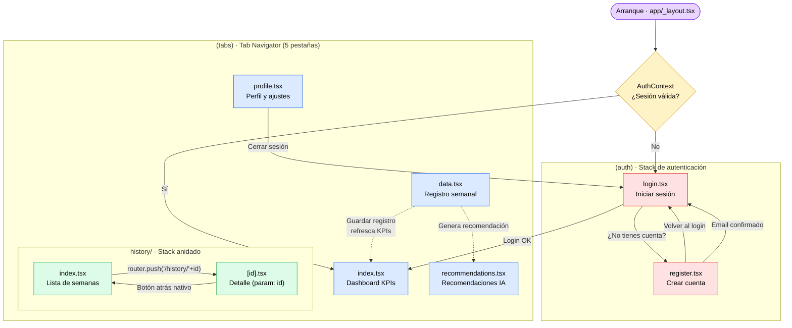
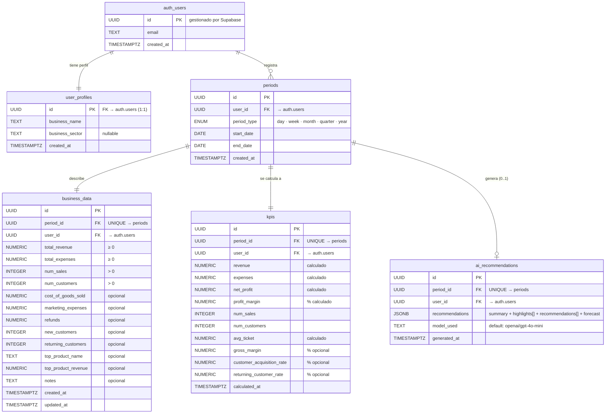

<div align="center">

# BizKPI

### Plataforma de Business Intelligence para pequeños negocios

*Registro semanal de KPIs · Análisis con IA · Historial exportable*

📘 [**Manual de usuario**](./MANUAL_USUARIO.md) · 🛠️ Documentación técnica (este archivo)


</div>

---

## Tabla de contenidos

1. [Descripción](#descripción)
2. [Características](#características)
3. [Arquitectura](#arquitectura)
4. [Cumplimiento de guías de diseño](#cumplimiento-de-guías-de-diseño)
5. [Stack tecnológico](#stack-tecnológico)
6. [Estructura del proyecto](#estructura-del-proyecto)
7. [Esquema de base de datos](#esquema-de-base-de-datos)
8. [API REST](#api-rest)
9. [Inteligencia artificial](#inteligencia-artificial)
10. [Puesta en marcha](#puesta-en-marcha)
11. [Tests](#tests)
12. [Despliegue en Render](#despliegue-en-render)
13. [Comandos útiles](#comandos-útiles)

---

## Descripción

BizKPI es una aplicación móvil multiplataforma (iOS / Android) orientada a propietarios de pequeños negocios — bares, restaurantes, tiendas locales, talleres, peluquerías — que necesitan entender la salud financiera de su negocio sin depender de herramientas complejas ni contratar a un analista.

El usuario introduce sus datos operativos una vez a la semana (ingresos, gastos, ventas, clientes). La app calcula automáticamente los KPIs más relevantes, los visualiza en un dashboard interactivo y, bajo demanda, envía los datos a un modelo de lenguaje que genera recomendaciones concretas y accionables adaptadas al tipo de negocio y al período analizado.

> Desarrollado como Trabajo de Fin de Grado (TFG).

---

## Características

| Módulo | Descripción |
|--------|-------------|
| **Dashboard** | KPIs en tiempo real: ingresos, clientes, margen neto y número de ventas, cada uno con su tendencia respecto a la semana anterior. Gráfico de línea de ingresos (6 semanas), gráfico de barras semanal y donut de distribución de categorías. |
| **Registro de datos** | Formulario guiado con campos obligatorios (ingresos, gastos, ventas, clientes) y opcionales (producto estrella, mejor/peor día, observaciones). Selector de semana con validación de período ya existente y posibilidad de reemplazar. |
| **Recomendaciones IA** | Análisis generado por GPT-4o-mini a partir de los KPIs del período. Devuelve: resumen ejecutivo, hasta 3 puntos clave (positivos / negativos / neutros), hasta 4 acciones concretas con prioridad y área, y previsión para la semana siguiente. |
| **Historial** | Lista navegable de todas las semanas registradas. Pantalla de detalle con gráfico de distribución beneficio/gastos y grid de 7 métricas. Eliminación de registros con confirmación. |
| **Exportación CSV** | Descarga del historial completo o de un rango de fechas seleccionado, con columnas de KPIs calculados e indicación de si existe recomendación IA. |
| **Perfil y preferencias** | Cambio de nombre del negocio, tema (claro/oscuro), moneda de visualización (EUR / USD / GBP / JPY) y idioma de la interfaz. Cambio de contraseña en la propia app. |
| **Multiidioma** | Español, inglés, francés, portugués, italiano y alemán. Las recomendaciones de IA también se generan en el idioma activo del usuario. |

---

## Arquitectura

### Diagrama general

```
┌─────────────────────────────────────────────────────────┐
│                    App móvil (Expo)                     │
│                                                         │
│  ┌──────────┐  ┌──────────┐  ┌─────────┐  ┌─────────┐   │
│  │Dashboard │  │  Datos   │  │   IA    │  │Historial│   │
│  └────┬─────┘  └────┬─────┘  └────┬────┘  └────┬────┘   │
│       └─────────────┴─────────────┴─────────────┘       │
│                       apiClient (Axios + JWT)           │
└───────────────────────────┬─────────────────────────────┘
                            │ HTTPS
                            ▼
┌─────────────────────────────────────────────────────────┐
│                  FastAPI  (Render)                      │
│                                                         │
│  /periods  /business-data  /kpis  /recommendations      │
│                    /users  /health                      │
│                                                         │
│  ┌────────────────┐    ┌──────────────────────────────┐ │
│  │  kpi_service   │    │        ai_service            │ │
│  │  (cálculo puro)│    │  (prompt builder + OpenAI)   │ │
│  └────────┬───────┘    └──────────────┬───────────────┘ │
└───────────┼───────────────────────────┼─────────────────┘
            │                           │
            ▼                           ▼
┌───────────────────────┐    ┌───────────────────────────┐
│  Supabase (PostgreSQL)│    │  OpenRouter / GPT-4o-mini │
│  - user_profiles      │    │                           │
│  - periods            │    │  Prompt en idioma activo  │
│  - business_data      │    │  → JSON estructurado      │
│  - kpis               │    │                           │
│  - ai_recommendations │    └───────────────────────────┘
└───────────────────────┘
```

### Arquitectura de navegación (expo-router)

#### Grafo de navegación

El siguiente diagrama representa el flujo completo del usuario: el *auth guard* del arranque, las cinco pestañas principales, el *stack* anidado del historial y el paso de parámetros por URL.



**Decisiones de routing destacables:**

- **Auth guard** en `(tabs)/_layout.tsx`: redirige automáticamente al login si no hay sesión activa, garantizando que ninguna pantalla protegida sea accesible sin token.
- **Persistencia de sesión**: `AuthContext` restaura el JWT desde `AsyncStorage` al iniciar la app, evitando que el usuario tenga que iniciar sesión en cada arranque.
- **Token refresh automático**: el cliente de Supabase notifica a `AuthContext` cuando renueva el *access token*, manteniendo la sesión viva sin intervención del usuario.
- **Paso de parámetros por ruta**: el detalle del historial recibe el `id` del período como parámetro de URL (`/history/[id]`), accesible mediante `useLocalSearchParams()` de expo-router.
- **Botón atrás nativo**: gestionado por expo-router sin código adicional, respetando el gesto *swipe back* de iOS y la tecla física/gesto de Android.
- **Tab bar inferior**: cinco pestañas conforme a las recomendaciones de iOS Human Interface Guidelines (máximo 5 elementos) y Material Design (Bottom Navigation).

#### Estructura de ficheros

```
app/
├── (auth)/
│   ├── _layout.tsx          Stack de autenticación
│   ├── login.tsx            Inicio de sesión
│   └── register.tsx         Registro de cuenta
│
└── (tabs)/
    ├── _layout.tsx          Tab bar principal (5 pestañas)
    ├── index.tsx            Dashboard de KPIs
    ├── data.tsx             Formulario de registro semanal
    ├── recommendations.tsx  Recomendaciones IA por semana
    ├── profile.tsx          Perfil y preferencias
    └── history/
        ├── _layout.tsx      Stack anidado dentro del tab
        ├── index.tsx        Lista de semanas registradas
        └── [id].tsx         Detalle de una semana concreta
```

### Diagrama de clases del backend

Vista estructural de los componentes del backend FastAPI: **modelos Pydantic** (validación + serialización), **servicios** (lógica de negocio), **routers** (endpoints HTTP) y la **infraestructura** (autenticación, configuración y clientes de servicios externos).

```mermaid
classDiagram
    direction TB

    %% ── DOMAIN MODELS (Pydantic) ────────────────────────────────────
    class PeriodType {
        <<enumeration>>
        day
        week
        month
        quarter
        year
    }
    class PeriodCreate {
        <<Pydantic BaseModel>>
        +period_type: PeriodType
        +start_date: date
        +end_date: date
        +end_after_start() date
    }
    class PeriodRead {
        <<Pydantic BaseModel>>
        +id: str
        +user_id: str
        +period_type: PeriodType
        +start_date: date
        +end_date: date
        +created_at: datetime?
    }
    class BusinessDataCreate {
        <<Pydantic BaseModel>>
        +period_id: str
        +total_revenue: Decimal
        +total_expenses: Decimal
        +num_sales: int
        +num_customers: int
        +cost_of_goods_sold: Decimal?
        +marketing_expenses: Decimal?
        +refunds: Decimal?
        +new_customers: int?
        +returning_customers: int?
        +top_product_name: str?
        +top_product_revenue: Decimal?
        +notes: str?
        +non_negative() Decimal
        +positive_int() int
    }
    class BusinessDataUpdate {
        <<Pydantic BaseModel>>
        +todos los campos: Optional
    }
    class BusinessDataRead {
        <<Pydantic BaseModel>>
        +id: str
        +period_id: str
        +user_id: str
        +todos los campos de Create
        +created_at: datetime?
        +updated_at: datetime?
    }
    class KpiRead {
        <<Pydantic BaseModel>>
        +id, period_id, user_id: str
        +revenue, expenses, net_profit: Decimal
        +profit_margin, avg_ticket: Decimal
        +num_sales, num_customers: int
        +gross_margin: Decimal?
        +customer_acquisition_rate: Decimal?
        +returning_customer_rate: Decimal?
        +calculated_at: datetime?
    }
    class RecommendationRead {
        <<Pydantic BaseModel>>
        +id, period_id, user_id: str
        +recommendations: dict
        +model_used: str
        +generated_at: datetime?
    }
    class UserProfileRead {
        <<Pydantic BaseModel>>
        +id: str
        +business_name: str
        +business_sector: str?
        +created_at: datetime?
    }
    class UserProfileUpdate {
        <<Pydantic BaseModel>>
        +business_name: str?
        +business_sector: str?
    }

    %% ── SERVICES ────────────────────────────────────
    class kpi_service {
        <<module · servicio>>
        +calculate_and_store(db, period_id, user_id, data) dict
        -_pct(num, den) Decimal
        -_round2(value) Decimal
    }
    class ai_service {
        <<module · servicio asíncrono>>
        +generate_and_store(openai, db, period_id, user_id, kpi, bdata, profile, period, language) async dict
        -_build_user_prompt(kpi, bdata, profile, period) str
        -_get_system_prompt(language) str
    }

    %% ── ROUTERS (FastAPI APIRouter) ────────────────────────────────────
    class periods_router {
        <<APIRouter /periods>>
        +list_periods() PeriodRead[]
        +create_period(PeriodCreate) PeriodRead
        +delete_period(id) 204
    }
    class business_data_router {
        <<APIRouter /business-data>>
        +list_business_data() BusinessDataRead[]
        +create_business_data(BusinessDataCreate) BusinessDataRead
        +update_business_data(id, BusinessDataUpdate) BusinessDataRead
        +delete_business_data(id) 204
    }
    class kpis_router {
        <<APIRouter /kpis>>
        +list_kpis() KpiRead[]
        +get_kpi(period_id) KpiRead
        +calculate_kpis(period_id) KpiRead
    }
    class recommendations_router {
        <<APIRouter /recommendations>>
        +list_recommendations() RecommendationRead[]
        +get_recommendation(period_id) RecommendationRead
        +generate(period_id, language) async RecommendationRead
        +delete(period_id) 204
    }
    class users_router {
        <<APIRouter /users>>
        +me() UserProfileRead
        +update_me(UserProfileUpdate) UserProfileRead
    }

    %% ── INFRASTRUCTURE ────────────────────────────────────
    class auth_dependency {
        <<FastAPI dependency>>
        +get_current_user_id(credentials) str
        -_get_public_key() ECPublicKey
        -_b64_to_int(b64) int
    }
    class Settings {
        <<Pydantic BaseSettings>>
        +supabase_url: str
        +supabase_service_key: str
        +supabase_jwt_jwk: str
        +openrouter_api_key: str
        +app_env: str
        +is_production() bool
    }
    class supabase_client {
        <<core · cliente>>
        +get_supabase() Client
    }
    class openai_client {
        <<core · cliente>>
        +get_openai() AsyncOpenAI
    }

    %% ── DEPENDENCIES (uses) ────────────────────────────────────
    PeriodCreate ..> PeriodType
    PeriodRead ..> PeriodType

    periods_router ..> PeriodCreate : valida
    periods_router ..> PeriodRead : serializa
    periods_router ..> auth_dependency : protege
    periods_router ..> supabase_client : DB

    business_data_router ..> BusinessDataCreate : valida
    business_data_router ..> BusinessDataUpdate : valida
    business_data_router ..> BusinessDataRead : serializa
    business_data_router ..> kpi_service : invoca
    business_data_router ..> auth_dependency : protege
    business_data_router ..> supabase_client : DB

    kpis_router ..> KpiRead : serializa
    kpis_router ..> kpi_service : invoca
    kpis_router ..> auth_dependency : protege
    kpis_router ..> supabase_client : DB

    recommendations_router ..> RecommendationRead : serializa
    recommendations_router ..> ai_service : invoca
    recommendations_router ..> auth_dependency : protege
    recommendations_router ..> supabase_client : DB

    users_router ..> UserProfileRead : serializa
    users_router ..> UserProfileUpdate : valida
    users_router ..> auth_dependency : protege
    users_router ..> supabase_client : DB

    kpi_service ..> supabase_client : upsert kpis
    ai_service ..> supabase_client : upsert recomendaciones
    ai_service ..> openai_client : llamada LLM

    auth_dependency ..> Settings : JWK
    supabase_client ..> Settings : URL+key
    openai_client ..> Settings : API key
```



### Lectura del diagrama

- **Modelos Pydantic** *(arriba)*: definen la forma de los datos que entran y salen de los endpoints. `*Create` valida entradas, `*Read` serializa salidas, `*Update` permite actualizaciones parciales.
- **Servicios** *(centro)*: encapsulan la lógica que no debe vivir en los routers. `kpi_service` es aritmético puro (testeable sin BD); `ai_service` es asíncrono y orquesta la llamada al LLM con el contexto del usuario.
- **Routers** *(centro-bajo)*: cada uno mapea a un *prefix* de URL. Solo se ocupan de:
  1. Recibir y validar la petición (Pydantic).
  2. Verificar autorización (`auth_dependency`).
  3. Delegar la lógica al servicio correspondiente.
  4. Devolver la respuesta serializada.
- **Infraestructura** *(abajo)*: clases utilitarias singleton (`Settings` cacheado, clientes Supabase / OpenAI vía `lru_cache`).
- **Flechas punteadas (`..>`)**: dependencia tipo *uses*. Ninguna clase del diagrama implementa herencia entre sí, salvo la implícita `BaseModel` / `BaseSettings` de Pydantic.

---

## Cumplimiento de guías de diseño

La aplicación se construye sobre React Native + Expo, que renderiza componentes nativos en cada plataforma. Más allá de la herencia automática del *look & feel* nativo, se han tomado decisiones explícitas de diseño para alinear la app con las guías oficiales de iOS (Human Interface Guidelines) y Android (Material Design 3).

### iOS — Human Interface Guidelines

**Navegación**

- *Tab bar* inferior con **5 destinos**, dentro del rango recomendado por HIG (3 – 5 elementos).
- **Iconos pareados** filled / outline según el estado activo de la pestaña, patrón nativo de iOS:
  `grid` ↔ `grid-outline`, `time` ↔ `time-outline`, `bulb` ↔ `bulb-outline`, etc.
- *Stack navigation* con **gesto de swipe-back lateral** activado por defecto (proporcionado por expo-router).
- No se duplican controles entre el *tab bar* y los *headers*.

**Áreas seguras**

- `useSafeAreaInsets()` en el *tab bar* para respetar la *home indicator* del iPhone X y posteriores.
- `SafeAreaProvider` montado en el layout raíz.
- Altura del *tab bar* adaptativa: `56 + insets.bottom`.

**Feedback táctil**

- `TouchableOpacity` con `activeOpacity={0.75}` en botones y `0.8` en *cards*.
- `hitSlop={{ top: 8, bottom: 8, left: 8, right: 8 }}` en iconos pequeños (toggle de contraseña, iconos de input) para garantizar áreas tocables ≥ 44 pt.

**Sombras nativas**

- `GlassCard` usa `shadowOffset`, `shadowOpacity`, `shadowRadius` y `shadowColor` — propiedades específicas de iOS — para sombras suaves.
- Sin `overflow: hidden` en el contenedor externo, para que la sombra se renderice fuera del *card* como exige el sistema.

**Tipografía**

- Pesos `'500'` para *labels* y `'600'` para CTA, acorde a la jerarquía de SF Pro.
- `letterSpacing: 0.2` en botones para mejorar la legibilidad en pantallas pequeñas.

### Android — Material Design 3

**Bottom Navigation**

- Cinco destinos visibles permanentemente (Material recomienda 3 – 5).
- Iconos de Ionicons consistentes con la apariencia *outlined* / *filled* de Material Symbols.
- Estado activo destacado con el color *primary* del tema.

**Elevación**

- `GlassCard` usa `elevation: 7` para la sombra nativa de Android.
- Botones planos (variante `ghost`) sin elevación, siguiendo la jerarquía de Material 3.

**Tamaño de los *targets* táctiles**

- Botón sm = 40 dp · md = 50 dp · lg = 56 dp; los principales superan el mínimo Material de 48 dp.
- `Input` con `minHeight: 50` dp.
- Los botones pequeños se compensan con `hitSlop` cuando se usan en iconos.

**Sistema de color**

| Token | Dark | Light |
|---|---|---|
| Primary | `#7C3AED` | `#6D28D9` |
| Primary light | `#8B5CF6` | `#7C3AED` |
| Accent | `#10B981` | `#059669` |
| Error | `#EF4444` | `#DC2626` |
| Background | `#06070B` | `#F8FAFC` |
| Text primary | `#F1F5F9` | `#0F172A` |

Paleta completa duplicada para tema claro y oscuro, siguiendo el modelo de *color tokens* de Material 3.

**Formas (Material 3 *shape scale*)**

- `borderRadius: 12` — *small shape* (inputs).
- `borderRadius: 14` — *medium shape* (botones).
- `borderRadius: 20` — *large shape* (cards, expuesto en el theme como `cardRadius`).

**Estados visuales**

| Estado | Tratamiento |
|---|---|
| Disabled | `opacity: 0.5` (spec Material 3) |
| Focus en input | Borde cambia a color *primary* |
| Error en input | Borde rojo + mensaje debajo (`color: error`) |
| Loading en botón | `ActivityIndicator` sustituye al label |

### Accesibilidad

- **Tema oscuro y claro** con conmutación en vivo desde el perfil.
- **Contraste AA** en ambos temas:
  - Dark: texto `#F1F5F9` sobre fondo `#06070B` → ratio > 15:1.
  - Light: texto `#0F172A` sobre fondo `#F8FAFC` → ratio > 14:1.
- `placeholderTextColor` claramente diferenciado del texto principal — evita confundir input vacío con relleno.
- `numberOfLines={1}` en botones para prevenir desbordamientos.
- `hitSlop` ampliado en iconos pequeños.
- Toggle de visibilidad de contraseña accesible (iconos `eye-outline` ↔ `eye-off-outline`).

### Decisiones multiplataforma

- **StatusBar** gestionada por `expo-status-bar`, con color adaptado al tema activo.
- Misma base de código en iOS y Android, divergiendo solo donde lo exige cada plataforma:
  - **Sombras:** `shadow*` en iOS, `elevation` en Android — ambos coexisten en `GlassCard`.
  - **Gestos atrás:** *swipe-back* en iOS, botón / gesto del sistema en Android — los dos gestionados por expo-router sin código extra.
  - **Feedback al pulsar:** `TouchableOpacity` (opacidad uniforme en iOS) en todas las superficies pulsables.
- Iconos de **Ionicons** disponibles en ambas plataformas con apariencia consistente.
- La app es **dark-first** (tema por defecto en `app.json`), con tema claro completo disponible desde ajustes.

---

## Stack tecnológico

### Frontend

| Tecnología | Versión | Rol |
|---|---|---|
| React Native | 0.76 | Base de la aplicación móvil |
| Expo SDK | 54 | Toolchain, builds y APIs nativas |
| expo-router | 4 | Navegación basada en ficheros (tabs + stack) |
| TypeScript | 5 | Tipado estático en todo el proyecto |
| react-i18next | latest | Internacionalización (6 idiomas) |
| Axios | latest | Cliente HTTP con interceptores JWT |
| AsyncStorage | latest | Persistencia local de sesión y preferencias |

### Backend

| Tecnología | Versión | Rol |
|---|---|---|
| Python | 3.11 | Runtime del servidor |
| FastAPI | 0.115 | Framework HTTP asíncrono |
| Pydantic v2 | 2.11 | Validación de modelos y settings |
| Supabase Python SDK | ≥2.15 | Cliente de base de datos y auth |
| OpenAI SDK | 1.54 | Llamadas al LLM vía OpenRouter |
| python-jose / PyJWT | latest | Verificación de tokens JWT (ES256 + HS256) |
| uvicorn | 0.32 | Servidor ASGI |

### Servicios externos

| Servicio | Uso |
|---|---|
| **Supabase** | Base de datos PostgreSQL gestionada + autenticación de usuarios (JWT) |
| **OpenRouter** | Gateway de acceso a modelos LLM con API compatible con OpenAI |
| **Render** | Hosting del backend FastAPI (PaaS, deploy automático desde Git) |

---

## Estructura del proyecto

```
TFG-1.0/
│
├── app/                          # Pantallas (expo-router)
│   ├── (auth)/                   # Flujo de autenticación
│   └── (tabs)/                   # Navegación principal
│       └── history/              # Stack anidado del historial
│
├── src/
│   ├── components/
│   │   ├── charts/               # LineChart, BarChart, DonutChart
│   │   ├── layout/               # ScreenWrapper, Header, AppBackground
│   │   └── ui/                   # Button, GlassCard, Input, Badge,
│   │                             # RecoBody, ExportModal, Loader…
│   ├── hooks/
│   │   ├── useKPIs.ts            # Datos del dashboard
│   │   ├── useDataEntries.ts     # CRUD de registros semanales
│   │   ├── useRecommendations.ts # Gestión de recomendaciones IA
│   │   └── useHistory.ts         # Historial con estado optimista
│   ├── lib/
│   │   └── apiClient.ts          # Axios + interceptor JWT automático
│   ├── mocks/                    # Datos semilla para desarrollo
│   ├── services/                 # Capa de acceso a la API
│   │   ├── authService.ts
│   │   ├── dataEntryService.ts
│   │   ├── kpiService.ts
│   │   ├── periodService.ts
│   │   ├── recommendationService.ts
│   │   └── userService.ts
│   ├── store/
│   │   └── AuthContext.tsx        # Estado global de autenticación
│   ├── theme/
│   │   └── ThemeContext.tsx       # Tema, moneda e idioma globales
│   ├── types/
│   │   └── index.ts              # Tipos globales (DataEntry, KpiMetric…)
│   ├── utils/
│   │   ├── formatters.ts         # fmt.currency, .percent, .date…
│   │   ├── periodHelpers.ts      # ISO weeks, rangos de fechas
│   │   ├── csvExporter.ts        # Exportación a CSV
│   │   └── storage.ts            # Wrapper AsyncStorage tipado
│   └── __tests__/                # Tests unitarios Jest
│
├── backend/
│   ├── app/
│   │   ├── core/                 # Config, clientes Supabase / OpenAI
│   │   ├── dependencies/         # Inyección de dependencias (auth)
│   │   ├── models/               # Schemas Pydantic
│   │   ├── routers/              # Endpoints FastAPI
│   │   └── services/
│   │       ├── kpi_service.py    # Cálculo de KPIs (aritmética pura)
│   │       └── ai_service.py     # Builder de prompts + llamada LLM
│   ├── supabase/
│   │   └── migrations/           # SQL del esquema inicial
│   ├── tests/                    # Tests unitarios pytest
│   ├── requirements.txt
│   ├── requirements-dev.txt
│   ├── runtime.txt               # Python 3.11.9
│   └── Procfile                  # Comando de arranque para Render
│
├── render.yaml                   # Configuración de despliegue (IaC)
└── README.md
```

---

## Esquema de base de datos

### Diagrama entidad-relación



### Decisiones de diseño

- **`auth.users` es responsabilidad de Supabase Auth** — el backend nunca toca esa tabla directamente; solo lee el `sub` (UUID) del JWT.
- **`user_profiles` extiende `auth.users` mediante una FK PK** — sin duplicar la lógica de autenticación. Un trigger SQL (`handle_new_user`) crea automáticamente el perfil al registrar un usuario.
- **Restricción `UNIQUE` sobre `period_id`** en `business_data`, `kpis` y `ai_recommendations` — garantiza una sola fila por período en cada una de estas tablas.
- **`ON DELETE CASCADE`** en todas las FK — al eliminar un usuario o un período, sus dependencias se borran automáticamente, evitando filas huérfanas.
- **`CHECK constraints`** sobre los campos numéricos críticos (`total_revenue ≥ 0`, `num_sales > 0`, etc.) — la validación se duplica en BD para defensa en profundidad respecto a la validación Pydantic.
- **`recommendations` se almacena como `JSONB`** — permite consultas eficientes sobre el contenido (operadores `->`, `->>`) sin necesidad de normalizar la respuesta de la IA en múltiples tablas.

### Seguridad (Row Level Security)

Todas las tablas tienen **RLS activo** con políticas `auth.uid() = user_id` (o `= id` en `user_profiles`). Esto significa que un cliente autenticado solo puede leer/escribir/borrar sus propias filas — la BD rechaza cualquier intento de acceso cruzado a nivel de motor, no a nivel de aplicación.

---

## API REST

Base URL: `https://<servicio>.onrender.com/api/v1`  
Autenticación: `Authorization: Bearer <supabase_jwt>`

### Períodos

| Método | Ruta | Descripción |
|--------|------|-------------|
| `GET` | `/periods/` | Lista todos los períodos del usuario |
| `POST` | `/periods/` | Crea un nuevo período |
| `DELETE` | `/periods/{id}` | Elimina un período y sus datos en cascada |

### Datos de negocio

| Método | Ruta | Descripción |
|--------|------|-------------|
| `GET` | `/business-data/` | Lista todos los registros |
| `POST` | `/business-data/` | Crea un registro + calcula y guarda KPIs |
| `PUT` | `/business-data/{id}` | Actualiza un registro + recalcula KPIs |
| `DELETE` | `/business-data/{id}` | Elimina un registro |

### KPIs

| Método | Ruta | Descripción |
|--------|------|-------------|
| `GET` | `/kpis/` | Lista todos los KPIs calculados |
| `GET` | `/kpis/{period_id}` | KPIs de un período concreto |
| `POST` | `/kpis/calculate/` | Recalcula KPIs a partir de un business_data |

### Recomendaciones IA

| Método | Ruta | Descripción |
|--------|------|-------------|
| `GET` | `/recommendations/` | Lista todas las recomendaciones |
| `GET` | `/recommendations/{period_id}` | Recomendación de un período |
| `POST` | `/recommendations/generate/` | Genera (o regenera) una recomendación con IA |
| `DELETE` | `/recommendations/{period_id}` | Elimina una recomendación |

### Usuario y salud

| Método | Ruta | Descripción |
|--------|------|-------------|
| `GET` | `/users/me` | Perfil del usuario autenticado |
| `PUT` | `/users/me` | Actualiza nombre del negocio |
| `GET` | `/health` | Estado del servicio (sin autenticación) |

La documentación interactiva (Swagger UI) está disponible en `/docs` en entorno de desarrollo.

---

## Inteligencia artificial

### Modelo
GPT-4o-mini vía [OpenRouter](https://openrouter.ai), con API compatible con OpenAI SDK.  
Se usa el modo asíncrono (`AsyncOpenAI`) para no bloquear el event loop de FastAPI.

### Construcción del prompt

`ai_service.py` construye un prompt con dos partes:

**System prompt** (fijo): define el rol del modelo como asesor de pequeños negocios, establece reglas de tono (directo, cercano, sin jerga corporativa), restricciones de longitud y el formato JSON de salida esperado.

**User prompt** (dinámico): incluye en el idioma activo del usuario:
- Tipo de período y rango de fechas
- Sector del negocio (si está disponible)
- KPIs del período: ingresos, gastos, beneficio, margen, ticket medio, ventas, clientes
- Producto más vendido con porcentaje sobre ingresos (si existe)
- Mejor y peor día (si se han introducido)
- Observaciones libres del propietario (si las hay)

### Estructura de respuesta (JSON)

```json
{
  "summary": "Resumen ejecutivo de 2-3 frases",
  "highlights": [
    {
      "type": "positive | negative | neutral",
      "title": "Título del punto",
      "description": "Explicación breve"
    }
  ],
  "recommendations": [
    {
      "area": "Área del negocio",
      "priority": "high | medium | low",
      "action": "Acción concreta",
      "rationale": "Por qué es importante"
    }
  ],
  "forecast": "Perspectiva para la próxima semana"
}
```

Máximo: 3 highlights · 4 recomendaciones.

---

## Puesta en marcha

### Requisitos previos

- [Node.js](https://nodejs.org) 18+
- [Python](https://python.org) 3.11+
- [Expo Go](https://expo.dev/go) en el dispositivo móvil (o emulador iOS/Android)
- Cuenta en [Supabase](https://supabase.com) con el esquema inicial aplicado
- Cuenta en [OpenRouter](https://openrouter.ai) con créditos disponibles

### 1. Clonar el repositorio

```bash
git clone https://github.com/<usuario>/<repo>.git
cd <repo>
```

### 2. Configurar el esquema de Supabase

En el **SQL Editor** de tu proyecto Supabase, ejecutar el contenido de:

```
backend/supabase/migrations/001_initial.sql
```

Esto crea las tablas, relaciones, índices, políticas RLS y el trigger de creación de perfil automático.

### 3. Variables de entorno

**Frontend** — crear `.env` en la raíz del proyecto:

```env
# Desarrollo local (misma red WiFi que el servidor)
EXPO_PUBLIC_API_URL=http://192.168.x.x:8000

# Producción (tras desplegar en Render)
# EXPO_PUBLIC_API_URL=https://<servicio>.onrender.com
```

**Backend** — crear `backend/.env`:

```env
# Supabase — Project Settings → API
SUPABASE_URL=https://<proyecto>.supabase.co
SUPABASE_SERVICE_KEY=<service_role_key>
SUPABASE_JWT_SECRET=<jwt_secret>
SUPABASE_JWT_JWK=<jwk_json_string>

# OpenRouter — openrouter.ai/keys
OPENROUTER_API_KEY=sk-or-...

# Entorno
APP_ENV=development
```

> ⚠️ Ningún fichero `.env` debe subirse al repositorio. Están incluidos en `.gitignore`.

### 4. Instalar dependencias del frontend

```bash
npm install
```

### 5. Instalar dependencias del backend

```bash
cd backend
python -m venv .venv

# macOS / Linux
source .venv/bin/activate

# Windows
.venv\Scripts\activate

pip install -r requirements.txt
```

### 6. Arrancar el backend

```bash
# Desde backend/ con el venv activo
uvicorn app.main:app --host 0.0.0.0 --port 8000 --reload
```

Verificar que el servidor responde: `http://localhost:8000/health`  
Swagger UI disponible en: `http://localhost:8000/docs`

### 7. Arrancar la app

```bash
# Desde la raíz del proyecto
npx expo start
```

Escanear el código QR con Expo Go (asegurarse de que el móvil y el PC están en la misma red WiFi).

---

## Tests

### Frontend — Jest

```bash
# Todos los tests
npx jest

# Con informe de cobertura
npx jest --coverage

# Modo watch (desarrollo)
npx jest --watch
```

| Suite | Fichero | Tests |
|---|---|---|
| Formateadores | `src/__tests__/formatters.test.ts` | 33 |
| Helpers de período | `src/__tests__/periodHelpers.test.ts` | 40 |
| **Total** | | **73** |

### Backend — pytest

```bash
cd backend

# Todos los tests
pytest -v

# Con cobertura
pytest --cov=app --cov-report=term-missing
```

| Suite | Fichero | Tests |
|---|---|---|
| Servicio de KPIs | `tests/test_kpi_service.py` | 16 |
| Servicio de IA | `tests/test_ai_service.py` | 26 |
| **Total** | | **42** |

**Total global: 115 tests.**

---

## Despliegue en Render

El fichero `render.yaml` en la raíz define el servicio web como código (IaC), listo para conectar con [Render](https://render.com).

### Pasos

**1.** Crear cuenta en render.com → **New → Web Service**

**2.** Conectar el repositorio de GitHub y seleccionar este proyecto.  
Render detecta `render.yaml` automáticamente y pre-rellena la configuración:
- Root Directory: `backend`
- Build Command: `pip install -r requirements.txt`
- Start Command: `uvicorn app.main:app --host 0.0.0.0 --port $PORT`

**3.** Ir a la pestaña **Environment** y añadir las siguientes variables:

| Variable | Dónde obtenerla |
|---|---|
| `SUPABASE_URL` | Supabase → Project Settings → API → Project URL |
| `SUPABASE_SERVICE_KEY` | Supabase → Project Settings → API → `service_role` secret key |
| `SUPABASE_JWT_SECRET` | Supabase → Project Settings → API → JWT Secret |
| `SUPABASE_JWT_JWK` | Supabase → Project Settings → API → JWT Public Key (formato JWK) |
| `OPENROUTER_API_KEY` | openrouter.ai → Keys |

**4.** Pulsar **Deploy** — Render construye la imagen e inicia el servicio.

**5.** Copiar la URL del servicio (p. ej. `https://bizkpi-api.onrender.com`) y actualizar `.env` del frontend:

```env
EXPO_PUBLIC_API_URL=https://bizkpi-api.onrender.com
```

**6.** Relanzar Expo con `npx expo start --clear`.

> **Plan gratuito de Render:** el servicio entra en reposo tras 15 minutos sin actividad. La primera petición tarda ~30 s en despertar el contenedor. Para demos, abrir `https://<servicio>.onrender.com/health` unos segundos antes de usar la app.

---

## Comandos útiles

```bash
# ── Frontend ──────────────────────────────────────────────────
# Verificar tipos TypeScript
npx tsc --noEmit

# Limpiar caché de Metro Bundler
npx expo start --clear

# Lint
npx expo lint

# ── Backend ───────────────────────────────────────────────────
# Formato de código
cd backend && black app/ tests/

# Comprobación de tipos
cd backend && mypy app/

# ── Git ───────────────────────────────────────────────────────
# Ver historial compacto
git log --oneline --graph
```
